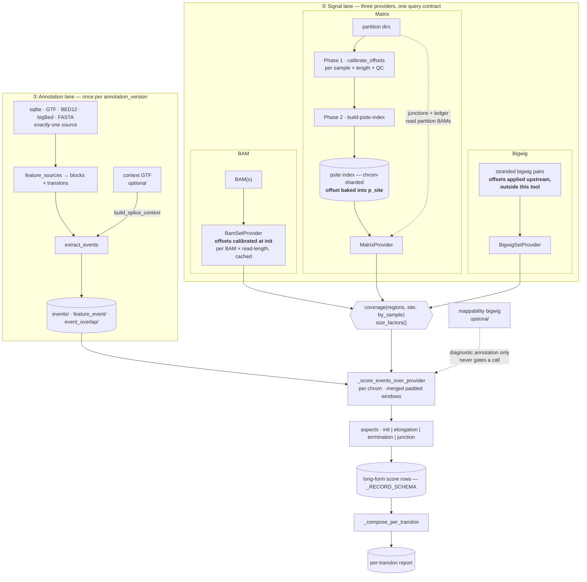

# Data flow

Two lanes that meet once. The annotation lane runs per `annotation_version` and
knows nothing about signal. The signal lane runs per cohort and knows nothing
about features. They meet at `_score_events_over_provider`, and only there.

## The three providers are not interchangeable

Every provider satisfies `coverage()` + `size_factors()`. Beyond that they differ,
and the differences are load-bearing rather than incidental.

| | BAM | Matrix | Bigwig |
|---|---|---|---|
| `coverage()` | ✅ | ✅ | ✅ |
| `junction_support()` | ✅ | ✅ | ❌ no CIGAR |
| `mappability_ledger()` | ✅ | ✅ | ❌ |
| **where offsets are applied** | provider init | index build | **upstream, outside the tool** |
| per-sample resolution | ✅ | ✅ | per-file only |

**Bigwig cannot score junction events at all.** `_warn_bigwig_cannot_score_junctions`
exists for this. Those events are unscorable, not unsupported, and the distinction
survives into the output.

**Offsets enter at three different points, and only two are inside the tool.**
The BAM path calibrates per BAM × read-length at provider init. The matrix path
bakes the offset into `p_site` at index build, which is why `MatrixProvider`
hard-errors without `psite_index_dir` — a flat offset across read lengths pins
`elong_in_frame` to the ~0.33 random floor. The bigwig path inherits whatever was
done upstream and cannot verify it.

Frame-sensitive metrics are therefore **not comparable across providers**, and a
threshold calibrated on one path is invalid on another.

## Invariants

1. An event is scored **once** per (provider, thresholds_version). Every feature
   claiming that event reads the same row.
2. `extract_events` is the only step that reads a feature source. Scoring never
   re-reads annotation.
3. The mappability track annotates; it never gates.
4. `eligibility` ("could we test this") is never conflated with `call`
   ("did it pass").
5. Thresholds are a versioned input. Changing one re-derives calls without
   re-measuring coverage.
