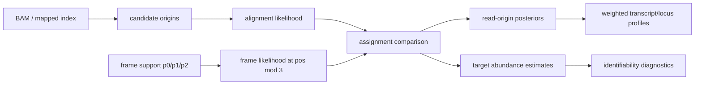

# Read Assignment Prototype Plan

Branch: `local/read-assignment-prototype`

## Goal

Extend TranslonScorer from frame-only posterior evidence to read-origin posterior evidence without making premature transcript-specific claims. The same candidate-table engine handles:

- transcript isoform ambiguity with `abundance_key=tran_id`
- genomic multi-locus ambiguity with `abundance_key=locus_id`
- joint locus/transcript ambiguity with `abundance_key=locus_id,tran_id`

## Model

Each read contributes one or more candidate origins:

```text
c = (locus_id, tran_id, transcript_pos)

P(c | read, data) proportional to:
  theta_target
  * alignment_likelihood(read | c)
  * frame_likelihood(transcript_pos | frame posterior)
```

`theta_target` is the abundance of the selected assignment target. The target can be a transcript, a locus, or a composite key. The current frame likelihood is:

```text
frame_likelihood = P(signal frame = transcript_pos mod 3 | local frame evidence)
```

This deliberately uses transcript-coordinate signal frame, not CDS-relative frame, because frame-support tables store `p0/p1/p2` by transcript coordinate residue class. When `support_evidence` is low, the frame term is blended back to neutral likelihood so weak frame calls do not force transcript or locus assignment.

## Method Ladder

| Method | What it tests | Expected behaviour |
| --- | --- | --- |
| `unique` | Conservative lower bound | Drops ambiguous reads. |
| `fractional` | Standard equal/likelihood split | Uses all reads but cannot learn origin abundance. |
| `frame_fractional` | Frame evidence without EM | Helps only when candidates are frame-discordant. |
| `em` | RSEM-style abundance EM | Uses unique/high-confidence reads to resolve ambiguous reads. |
| `frame_em` | Abundance EM plus frame compatibility | Should match `em` when frame is uninformative and beat it when frame is informative. |

## Execution Path



The current implementation starts at `candidate origins` so it can test the inference layer independently from BAM parsing. Candidate tables can come from the existing mapped-index path, the frame-disambiguation BAM projection, or synthetic benchmarks.

Candidate rows are collapsed to `(read_key, assignment_target)` before target-level posterior inference. The target likelihood uses the best internal candidate likelihood, then the inferred target posterior is distributed back over candidate-origin rows. This prevents annotation multiplicity, such as many transcript models inside one locus, from making that locus artificially more likely.

Candidate table contract:

- required: `tran_id` and one transcript position column: `tran_start_bam`, `tran_start`, `pos`, or `start_pos_tran`
- read identity: `read_key`, `qname`, `read_id`, or genomic coordinate columns
- optional target columns: `locus_id`, `gene_id`, or any columns named in a composite `abundance_key`
- optional likelihood columns: `candidate_likelihood`, `alignment_likelihood`, or `mapq`
- optional benchmark column: boolean `is_true`

## Implemented

- Python: `TranslonScorer.pipeline.read_assignment.assign_reads`
- Python: `TranslonScorer.pipeline.read_assignment.compare_read_assignment_methods`
- CLI: `translonscorer compare-read-assignment`
- Tests: `tests/test_read_assignment.py`
- Simulation report: `notebooks/read_assignment_prototype_simulation.py`

Outputs from `compare-read-assignment`:

- `<prefix>.read_assignment.summary.csv`
- `<prefix>.read_assignment.convergence.csv`
- `<prefix>.read_assignment.abundance.csv`
- `<prefix>.read_assignment.identifiability.csv`
- optional `<prefix>.<method>.read_assignments.parquet`

## First Simulation Gate

The deterministic simulation covers four regimes:

- frame-discordant isoforms
- abundance-resolvable isoforms
- genomic multi-locus reads with unique anchors
- deliberately aliased reads with no frame or abundance evidence

Current result:

- `frame_em` is best when frame evidence distinguishes the candidate origins.
- `em` is best when unique reads anchor transcript or locus abundance.
- `frame_em` matches `em` when frame evidence is uniform.
- aliased reads remain at chance, which is the desired identifiability behaviour.

Generated files:

- `notebooks/read_assignment_simulation.summary.csv`
- `notebooks/read_assignment_simulation.png`
- `notebooks/read_assignment_simulation.md`

## First Real Candidate-Origin Probe

The probe in `notebooks/read_assignment_real_candidate_probe.py` converts a transcriptome-aligned RiboMetric sample BAM into candidate origins by parsing transcript and gene IDs from BAM reference names.

Generated files:

- `notebooks/read_assignment_real_candidate_probe.candidates.parquet`
- `notebooks/read_assignment_real_candidate_probe.candidate_summary.csv`
- `notebooks/read_assignment_real_candidate_probe.assignment_summary.csv`
- `notebooks/read_assignment_real_candidate_probe.png`
- `docs/read_assignment_real_candidate_probe.md`

Current substrate result:

- 35,804 read keys and 68,417 weighted reads.
- Mean candidate transcript targets per read: 7.799.
- Mean candidate locus targets per read: 1.863.
- 88.50% of read keys are transcript-ambiguous.
- 20.78% of read keys are locus-ambiguous.
- Transcript-level EM reduces normalized assignment entropy from 0.846 to 0.384.
- Locus-level EM reduces normalized assignment entropy from 0.263 to 0.084.
- Without a frame-support join, `frame_em` exactly matches `em`, which confirms neutral frame handling.
- Transcript-level EM leaves a mixed uncertainty profile: 15.38% unique, 27.73% resolved, 24.15% ambiguous, and 32.75% data-limited by weighted reads.
- Locus-level EM is much cleaner: 73.69% unique, 15.66% resolved, 6.13% ambiguous, and 4.52% data-limited by weighted reads.

## First Matched Frame-Support Probe

The probe in `notebooks/read_assignment_matched_frame_probe.py` joins the real candidate-origin table to two matched frame-support tracks:

- `unique_transcript`: independent support from reads with exactly one compatible transcript target.
- `fractional_all`: exploratory support from all candidate origins with fractional weights.

Generated files:

- `notebooks/read_assignment_matched_frame.assignment_summary.csv`
- `notebooks/read_assignment_matched_frame.identifiability_summary.csv`
- `notebooks/read_assignment_matched_frame.posterior_delta_summary.csv`
- `notebooks/read_assignment_matched_frame.high_shift_examples.csv`
- `notebooks/read_assignment_matched_frame_probe.png`
- `docs/read_assignment_matched_frame_probe.md`
- `docs/read_assignment_linc01783_case_review.md`

Current result:

- Independent `unique_transcript` support is sparse: 3,933 frame rows across 1,623 transcripts, total count 10,521.0, and matched support for 9.8% of weighted candidate reads.
- With independent support, `frame_em` shifts transcript assignment only modestly relative to `em`: weighted mean TV distance 0.0018, with 0.65% of weighted reads moving by at least 0.10.
- Applying a minimal quality gate (`total_count >= 10` and `support_evidence >= 0.2`) changes the independent-support shift only slightly: weighted mean TV distance 0.0016, still with 0.65% of weighted reads moving by at least 0.10.
- Exploratory `fractional_all` support shifts more: transcript-level weighted mean TV distance 0.0318, with 6.17% of weighted reads moving by at least 0.10. This is an upper-bound sensitivity check because ambiguous reads contribute to the support track.
- The same gate reduces exploratory `fractional_all` shift to weighted mean TV distance 0.0281, with 5.76% of weighted reads moving by at least 0.10.
- Independent high-shift reads concentrate around `LINC01783`: 57 read keys, 443.0 weighted reads, mean TV 0.205, and about 7 compatible transcripts per read.
- Targeted review of the LINC01783 cluster found independent frame support for only one transcript (`ENST00000415386.2`), with 29 unique-support counts across 3 codons.

Decision:

- The frame-aware assignment machinery is working, and the neutral-control behavior is correct.
- This substrate does not justify a broad real-data claim yet. It supports a narrower claim: frame-aware EM should remain in development, but production gating needs stronger matched frame support and locus-level review before transcript-specific shifts are interpreted biologically.
- Frame-support quality gates are now implemented in the assignment engine and CLI. The remaining work is threshold calibration on production data, not basic gate plumbing.

## Scaled 10% BAM Probe

The scaled probe in `notebooks/read_assignment_scaled_bam_probe.py` repeats the matched assignment analysis on the larger local RiboMetric `subsampled_10_percent.bam`.

Generated files:

- `notebooks/read_assignment_ribometric_10pct.candidates.parquet`
- `notebooks/read_assignment_ribometric_10pct.assignment_summary.csv`
- `notebooks/read_assignment_ribometric_10pct.posterior_delta_summary.csv`
- `notebooks/read_assignment_ribometric_10pct.high_shift_locus_summary.csv`
- `docs/read_assignment_ribometric_10pct.matched_frame_probe.md`
- `docs/read_assignment_ribometric_10pct.ENSG00000228549.high_shift_examples.locus_review.md`
- `docs/read_assignment_ribometric_10pct.coding_shift_scan.md`
- `docs/read_assignment_ribometric_10pct.CIC.coding_shift_scan.locus_review.md`
- `docs/read_assignment_ribometric_10pct.PTCH1.coding_shift_scan.locus_review.md`
- `docs/read_assignment_ribometric_10pct.POGK.coding_shift_scan.locus_review.md`
- `docs/read_assignment_ribometric_10pct.OAZ2.coding_shift_scan.locus_review.md`
- `docs/read_assignment_ribometric_10pct.coding_locus_panel_seed.md`
- `docs/read_assignment_ribometric_10pct.input_assumption_audit.md`
- `notebooks/read_assignment_failure_case_walkthrough.ipynb`
- `notebooks/read_assignment_profile_disambiguation_walkthrough.ipynb`
- `docs/read_assignment_ribometric_10pct.profile_disambiguation.md`
- `docs/read_assignment_coverage_paths.md`
- `docs/read_assignment_ribometric_10pct.ESRRAP2.coding_shift_scan.locus_review.md`
- `docs/read_assignment_ribometric_10pct.OLFM1.coding_shift_scan.locus_review.md`
- `docs/read_assignment_ribometric_10pct.CDV3.coding_shift_scan.locus_review.md`
- `docs/read_assignment_ribometric_10pct.TMEM271.coding_shift_scan.locus_review.md`
- `docs/read_assignment_ribometric_10pct.DSCAM.coding_shift_scan.locus_review.md`
- `docs/read_assignment_ribometric_10pct.IL17D.coding_shift_scan.locus_review.md`
- `docs/read_assignment_ribometric_10pct.H1-2.coding_shift_scan.locus_review.md`
- `docs/read_assignment_ribometric_10pct.NDUFS5.coding_shift_scan.locus_review.md`
- `docs/read_assignment_ribometric_10pct.RCE1.coding_shift_scan.locus_review.md`

Current result:

- 358,510 read keys and 828,006 weighted reads.
- 88.53% of read keys are transcript-ambiguous; 21.25% are locus-ambiguous.
- Independent frame support covers 33,269 frame rows across 5,540 transcripts, with matched support for 12.8% of weighted candidate reads.
- Independent `frame_em` shifts transcript assignment more than in the 1% probe: weighted mean TV distance 0.0257, with 3.00% of weighted reads moving by at least 0.10.
- With the minimal quality gate, the independent shift remains similar: weighted mean TV distance 0.0231, with 2.93% of weighted reads moving by at least 0.10.
- The input-assumption audit fails this BAM as a frame-validation substrate. Scanning offsets 0-21 from the alignment start against annotated CDSs gives a best global frame fraction of only 0.368, with offset 0 at 0.365. This is too close to uniform to validate frame-aware biology.
- The high-shift independent mass is still concentrated: `ENSG00000228549` accounts for 97.3% of weighted high-shift reads in the exported high-shift locus summary.
- Targeted review shows that the `ENSG00000228549`/`LINC01783` cluster is a tight lncRNA ambiguity block, not a clean translated isoform validation case.
- A coding-associated scan found 111 high-shift read keys involving protein-coding candidates, 1,989 weighted reads total. Of these, 63 read keys and 1,254 weighted reads have gated local frame support; the rest are abundance-propagated EM shifts.
- The top coding-associated frame-top label is `CIC` with 671 weighted reads, but only 1 weighted read has gated local frame support and the reviewed reads average 28.5 compatible transcript rows across 46 candidate gene labels. This is broad multi-locus ambiguity rather than within-gene isoform resolution.
- A seed review panel now separates direct local-frame-supported candidates from abundance-propagated candidates. The best lower-locus direct candidates are `POGK`, `H1-2`, `OAZ2`, `H1-4`, `MT-CO1`, and `NDUFS5`; `PTCH1` is lower-locus but abundance-propagated, with no matched local frame-support rows in the reviewed candidates.
- Targeted review of `POGK` and `OAZ2` shows they are still cross-gene cases (`POGK`/`FLYWCH1` and `OAZ2`/`IL17D`) rather than clean within-gene isoform validation examples.
- The failure-case notebook walks through the reviewed cases as validation categories: noncoding annotation-block ambiguity (`LINC01783`/`ENSG00000228549`), broad multi-locus ambiguity (`CIC`, `OLFM1`, `TMEM271`), pseudogene/parent-gene ambiguity (`ESRRAP2`), same-gene no-local-frame-support ambiguity (`PTCH1`, `RCE1`), paralog ambiguity (`H1-2`/`H1-4`), underpowered same-gene ambiguity (`NDUFS5`), and direct-frame but cross-gene cases (`POGK`, `OAZ2`/`IL17D`).
- The profile-disambiguation notebook shows selected-read transcript profiles before and after `raw_compatible`, `unique_only`, `fractional`, `em`, and gated `frame_em`. These plots make the current failure modes visually obvious: many examples are sparse, multi-locus, or abundance-propagated rather than clean profile reconstruction on one correct isoform.
- The coverage-paths note separates available deep P-site profile data from the missing read-level validation substrate. The available profile data is enough for frame inference and plotting; it is not enough for read-origin validation because read ambiguity has already been collapsed away.

Decision:

- Scaling up reveals measurable frame-induced posterior movement, so the frame term is not merely a tiny numerical effect.
- The observed movement is still not the biological claim we need. It is dominated by a noncoding ambiguity block plus broad multi-locus coding-associated reads, and the input BAM does not meet the P-site/frame-signal assumption required for biological validation.
- The next validation target should be curated coding or dual-coding loci with direct local frame support and known transcript structure, not genome-wide top-shift reads from this transcriptome BAM.

## Coverage-First Calibration Update

The high-shift-first review was too biased toward sparse or odd cases. A coverage-first scan now asks which same-locus protein-coding transcript ambiguities have enough read support to be worth calibrating before looking at model movement.

Generated files:

- `docs/read_assignment_ribometric_10pct.coverage_first_calibration.md`
- `docs/read_assignment_ribometric_10pct.coverage_first_deep_profile_support.md`
- `docs/read_assignment_ribometric_10pct.coverage_first_profile_walkthrough.md`
- `notebooks/read_assignment_coverage_first_profile_walkthrough.ipynb`
- `notebooks/read_assignment_ribometric_10pct.coverage_first.panel_seed.csv`
- `notebooks/read_assignment_ribometric_10pct.coverage_first.deep_profile.linear_hmm_frame_support.parquet`
- `notebooks/read_assignment_ribometric_10pct.coverage_first.profile_walkthrough.em_vs_frame_shift.csv`

Current result:

- There are much better-covered ambiguous features than the earlier failure examples. Same-locus transcript ambiguity is abundant in genes including `TGFBI`, `FN1`, `ANPEP`, `TIMP1`, `ANGPTL4`, `LGALS1`, `S100A6`, `HRAS`, `TMC5`, and `CDK6`.
- The sparse unique-read frame table is not the right calibration source for these cases. The useful frame evidence comes from the high-depth forward/reverse RiboCrypt transcript profiles.
- The deep-profile support pass pulled 97 candidate transcripts for the top 10 same-locus genes and built `linear`, `linear+hmm`, and `latent` frame-support tables.
- A new conservative assignment rule is implemented: frame likelihood is used only when every candidate target for a read has gated frame support. This prevents the model from preferring a no-support transcript simply because a supported transcript has locally incompatible frame evidence.
- Under that complete-support gate, the strongest frame-driven assignment movement in the profile walkthrough is `FN1` (71.1% of assigned count shifted relative to EM), followed by `HRAS` (40.7%), `ANPEP` (16.5%), `S100A6` (16.3%), and `TGFBI` (13.6%).
- High coverage alone is not enough. `TGFBI`, `TIMP1`, and `LGALS1` have many supported reads but low frame-informative fractions, meaning the candidate transcript structures mostly share the same frame information at the ambiguous positions.

Decision:

- The validation order changes to coverage and biological-class gate first, frame movement second.
- The frame-aware EM path remains worth testing, but only with complete/comparable frame-support gating.
- The best immediate real-data inspection targets are the coverage-first plots in the new notebook, especially `FN1` and `ANPEP`; the low-informative high-coverage genes are equally important negative controls.

## Next Gates

1. Manually curate the seed coding panel in `docs/read_assignment_ribometric_10pct.coding_locus_panel_seed.md`, prioritising direct local-frame-supported, lower-locus-ambiguity candidates over abundance-propagated shifts.
2. Run the same candidate-origin plus frame-support workflow on a true production matched BAM/profile pair when available; the current local scale-up is still a transcriptome-BAM probe.
3. Calibrate the new frame-support quality gates on production data, using minimum independent support and local evidence thresholds.
4. Add locus-stratified posterior reports to identify transcript-resolved, locus-resolved, aliased, and data-limited cases.
5. Add truth-labelled synthetic mixtures with realistic transcript structures, mapping qualities, read lengths, and P-site offset uncertainty.
6. Add a sparse joint posterior export for RDG-Flux: `P(locus, transcript, frame | read/profile evidence)`.
